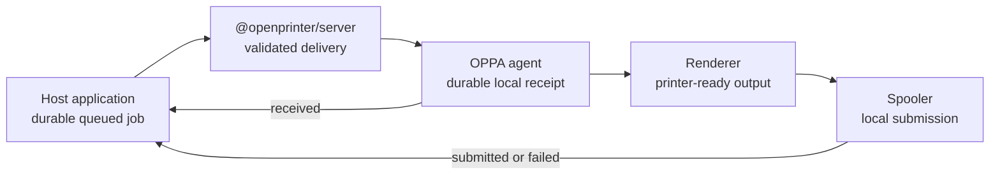

# OPPA and OpenPrinter

OPPA is the **Open Printer Proxy Agent**: a lightweight desktop application that connects a cloud
application to printers available on a local computer or private network.

OpenPrinter is the generic protocol and server SDK ecosystem used to integrate OPPA into an existing
application:

- [`@openprinter/protocol`](packages/protocol) — canonical schemas, codecs, and TypeScript types
- [`@openprinter/server`](packages/server) — transport-neutral protocol sessions and delivery

OPPA does not contain restaurant, branch, kitchen, billing, tenant, or other integrating-application
business concepts. The host application owns authorization policy, durable server-side jobs, retry
schedules, and logical printer routing.

## Delivery model



The safety-critical ordering is:

```text
receive → validate → persist → acknowledge → render → submit → persist result → report
```

`submitted` means a local backend accepted the job. It does not universally prove that paper was
physically printed.

## Repository map

```text
apps/
  oppa/                 Tauri + React desktop host
  www/                  Fumadocs landing and documentation site
crates/
  oppa-agent/           shell-independent runtime and state machine
  oppa-auth/            discovery, pairing, and Ed25519 credentials
  oppa-core/            typed IDs, timestamps, and shared domain primitives
  oppa-discovery/       provider isolation, normalization, and inventory changes
  oppa-platform/        credentials, paths, startup, notifications, identity
  oppa-printer/         printer descriptors, fingerprints, capabilities, backends
  oppa-product/         compile-time product validation and embedding
  oppa-protocol/        Rust OpenPrinter wire types and validation
  oppa-renderer/        structured receipt rendering
  oppa-spooler/         system queue, raw TCP, and virtual submission
  oppa-storage/         SQLite migrations, idempotency, and recovery
  oppa-transport/       authenticated WebSocket transport and reconnect state
packages/
  protocol/             @openprinter/protocol
  server/               @openprinter/server
protocol/
  fixtures/             shared cross-language payloads
  schema/               generated language-neutral JSON Schema
examples/
  node-server/          local discovery, pairing, and gateway integration
products/
  default/              default open-source product definition
```

## Prerequisites

- Node.js 22 or newer
- pnpm 11
- Rust stable with `rustfmt` and Clippy
- the native prerequisites for Tauri on the target platform

## Development setup

```bash
pnpm install
```

Run the development server:

```bash
pnpm --filter openprinter-node-example dev
```

In another terminal, launch the desktop agent with the default local product:

```bash
OPPA_PRODUCT_DIR=products/default pnpm oppa:dev
```

Enter the example server URL and its logged pairing code, create a virtual printer, and send a test job. See
the [Getting Started guide](apps/www/content/docs/getting-started.mdx) for the complete walkthrough.

Run the documentation site:

```bash
pnpm docs:dev
```

## Workspace commands

```bash
pnpm build             # JavaScript applications/packages and Cargo workspace
pnpm test              # Vitest and Rust tests
pnpm lint              # ESLint and Clippy
pnpm format            # oxfmt and rustfmt
pnpm format:check      # non-mutating format validation
pnpm typecheck         # TypeScript project checks
pnpm protocol:generate # regenerate the canonical JSON Schema
```

Physical printers are not required in CI. Renderer, storage, lifecycle, SDK, and compatibility tests
use mocks, fixtures, and virtual printers.

## Server integration

```ts
import { createOpenPrinterServer } from '@openprinter/server';

const openPrinter = createOpenPrinterServer({
  brand: { name: 'Acme POS' },
  serverId: 'acme-openprinter',
  onAgentConnected({ agent, session }) {
    liveSessions.register(agent.agentId, session);
  },
  onAgentDisconnected({ agent, session }) {
    liveSessions.removeIfCurrent(agent.agentId, session);
  },
  onJobReceived({ agent, message }) {
    jobs.markReceived(agent.agentId, message.payload.jobId);
  },
  onJobSubmitted({ agent, message }) {
    jobs.markSubmitted(agent.agentId, message.payload.jobId);
  },
});

const session = openPrinter.accept({
  transport: {
    send: (message) => connection.send(message),
    close: ({ reason, detail }) => connection.close(mapCloseReason(reason), detail),
  },
});

connection.onMessage((message) => void session.receive(message));
connection.onClose(() => void session.transportClosed());
```

The SDK authenticates the initial transport challenge against the host-provided public credential
store. The host owns HTTP/WebSocket lifecycle, durable credential persistence, rate limiting,
live-session routing, and cluster coordination. The application stores a job before selecting a
session and calling `sendJob`; if no worker owns a live session, it retains the queued job.

## Product builds

Product configuration is versioned, validated, and embedded at compile time:

```bash
OPPA_PRODUCT_DIR=products/default pnpm oppa:build
```

A product definition controls branding, application identity, support links, update configuration,
and supported feature switches. The user selects one OpenPrinter server base URL at runtime.
Discovery supplies its pairing and gateway endpoints. Changing the base URL deletes the previous
local private key and requires pairing with the selected service.

Runtime configuration cannot change product identity, branding, or compiled capabilities. It
cannot enable code absent from the binary, and OPPA never trusts an editable runtime `product.json`.

## Security

OPPA is a privileged local bridge and deliberately exposes a narrow command surface:

- documented protocol messages only
- no arbitrary shell, script, filesystem, SQL, or generic proxy commands
- bounded messages, documents, images, queues, and diagnostic history
- short-lived, single-use pairing grants and socket-bound Ed25519 challenges
- private keys stored through operating-system secure storage, never SQLite
- production `https:` discovery/pairing and `wss:` gateways
- explicit printer and network timeouts
- sanitized diagnostics without private keys, pairing codes, or full print payloads

See the [security documentation](apps/www/content/docs/security.mdx) before deploying an agent
gateway.

## Contributing

Read [`AGENTS.md`](AGENTS.md) and the scoped guidance in the workspace unit you are changing. Use
conventional commits, update public documentation with API behavior, and run:

```bash
pnpm format:check
pnpm lint
pnpm typecheck
pnpm test
pnpm build
```

See [`CONTRIBUTING.md`](CONTRIBUTING.md) for the contribution workflow.

## Changelog and releases

Git Cliff groups conventional commits into a root [`CHANGELOG.md`](CHANGELOG.md):

```bash
pnpm changelog:unreleased
pnpm changelog
```

The detailed process is documented in the
[release guide](apps/www/content/docs/release-process.mdx).

## License

OPPA and OpenPrinter are available under the [MIT License](LICENSE).
