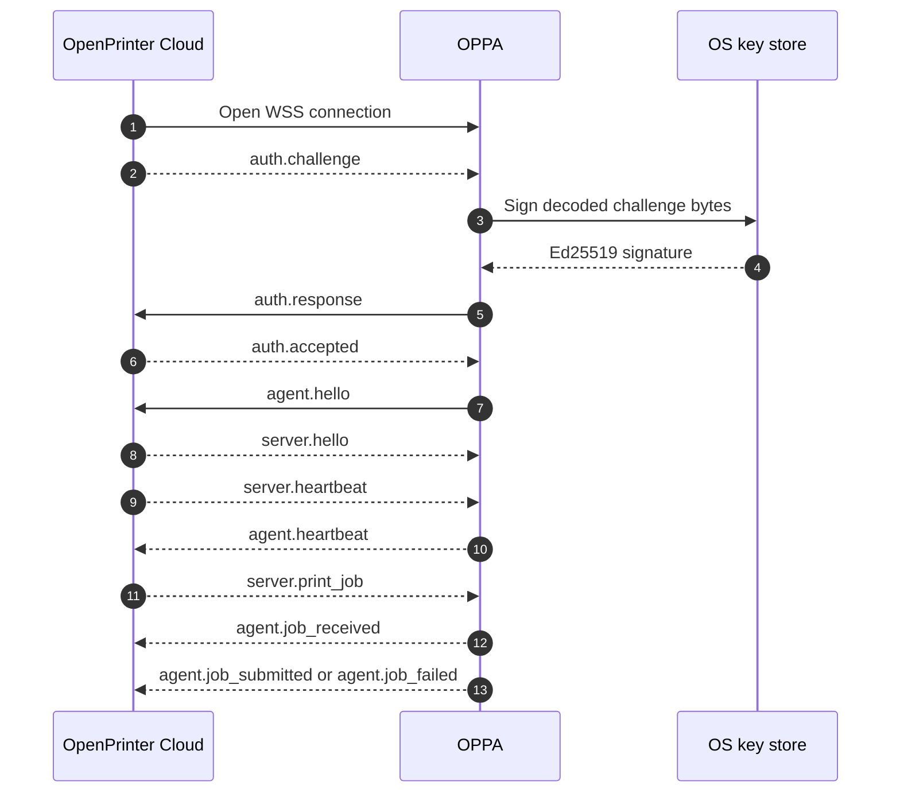

The agent gateway is the narrow, private WebSocket connection between
a paired OPPA installation and an OpenPrinter server. It carries agent
authentication, session negotiation, printer inventory, job delivery,
and delivery results.

<Cards className="my-6">
  <Card
    title="Build an OPPA-compatible agent"
    description="Implement pairing, authentication, handshake, inventory, and job delivery."
    href="/docs/agent-gateway/serverSendsAuthChallenge"
  />
  <Card
    title="Browse the operation reference"
    description="Open every server-to-agent and agent-to-server message with its schema and example."
    href="/docs/agent-gateway/serverSendsPrintJob"
  />
  <Card
    title="Use the public REST API"
    description="Create durable jobs and manage project access without speaking the private socket protocol."
    href="/docs/openprinter-cloud"
  />
</Cards>

## Gateway at a glance

<Cards className="my-6">
  <Card
    title="Private socket"
    description="Only a paired OPPA agent connects to this gateway. Application servers use the public REST API."
  />
  <Card
    title="Authenticated session"
    description="Every connection starts with a socket-bound Ed25519 challenge before normal protocol traffic."
  />
  <Card
    title="At-least-once delivery"
    description="The server may retry a job until OPPA confirms durable local persistence."
  />
</Cards>

## Connection flow

The gateway has two phases: a short authentication exchange, followed
by the versioned OpenPrinter session. The private key stays in the
operating system key store throughout the exchange.

<Callout type="info" title="The handshake is ordered">
  Send `agent.hello` on every authenticated connection, including
  reconnects. Wait for `server.hello` before sending inventory,
  diagnostics, or job acknowledgements. Authentication frames are
  special and do not use the normal versioned application envelope.
</Callout>

## Job lifecycle

The gateway reports protocol milestones rather than a universal
physical print result. Use `jobId` and `idempotencyKey` to make local
persistence and processing safe when delivery is retried.

<Cards className="my-6">
  <Card
    title="agent.job_received"
    description="Durable local receipt"
  >
    OPPA has safely persisted the complete job in its local queue. The
    server can stop redelivering this job.
  </Card>
  <Card
    title="agent.job_submitted"
    description="Local backend handoff"
  >
    An enabled local printer backend accepted the job. This does not
    claim that paper was physically produced.
  </Card>
  <Card title="agent.job_failed" description="Bounded failure report">
    Local processing stopped with a sanitized error and a `retryable`
    hint for the server.
  </Card>
</Cards>

## Message conventions

After authentication, normal application messages use the same
envelope:

| Field             | Meaning                                                       |
| ----------------- | ------------------------------------------------------------- |
| `protocolVersion` | Negotiated OpenPrinter protocol version.                      |
| `messageId`       | Stable identity for this message and its retries.             |
| `sentAt`          | RFC 3339 timestamp generated by the sender.                   |
| `type`            | Stable message discriminator such as `server.print_job`.      |
| `payload`         | Message-specific data validated against the operation schema. |
| `correlationId`   | Optional request identity when this message is a response.    |

## Operation map

The complete reference is generated from the checked-in
`apps/www/asyncapi/openprinter-cloud.yml` snapshot. The sidebar keeps
every operation grouped by lifecycle area.

<Cards className="my-6">
  <Card
    title="Authentication"
    description="Challenge, signature, acceptance, and rejection."
    href="/docs/agent-gateway/serverSendsAuthChallenge"
  />
  <Card
    title="Session and inventory"
    description="Hello, heartbeats, printer snapshots, changes, and disconnects."
    href="/docs/agent-gateway/agentSendsHello"
  />
  <Card
    title="Jobs and diagnostics"
    description="Delivery, acknowledgements, cancellation, invalidation, and health."
    href="/docs/agent-gateway/serverSendsPrintJob"
  />
</Cards>

<Callout type="info" title="Public API boundary">
  Use the [Neplex OpenPrinter Cloud REST API](/docs/openprinter-cloud)
  for project API keys, durable job creation, job listing, errors, and
  the TypeScript SDK. The private gateway is an agent transport, not a
  replacement for that API.
</Callout>
