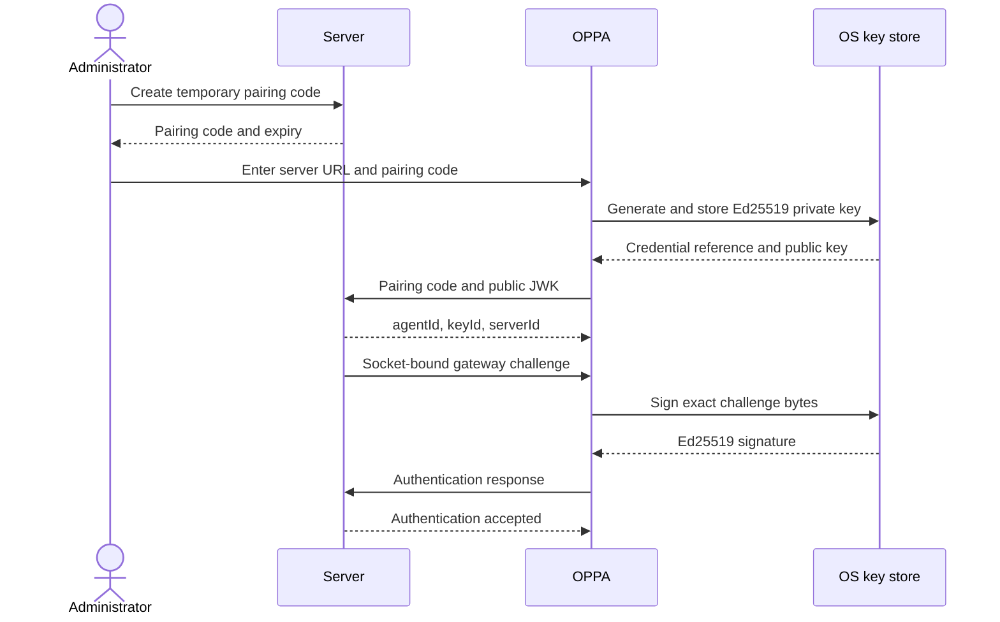

OPPA uses one configured OpenPrinter server base URL. It discovers the
current service identity and endpoints, pairs once with a short-lived
code, and authenticates each WebSocket connection by signing a server
challenge.

## Discovery

OPPA requests `GET /.well-known/openprinter` whenever it needs to
establish a connection. The validated response contains the protocol
version, stable server ID, server display/version metadata, pairing
and gateway endpoints, authentication method, and challenge lifetime.

Relative endpoints resolve against the configured base URL. HTTP
gateway URLs become WS; HTTPS becomes WSS. A paired configuration
stores the stable server ID. If discovery later returns another ID for
that URL, OPPA stops and requires explicit re-pairing.

## Pairing

1. An authorized server workflow creates a random, short-lived pairing
   code.
2. The user enters the code in OPPA; it is sent only in the POST body.
3. OPPA generates an Ed25519 key pair and places the private key in
   operating-system secure storage.
4. OPPA sends its agent metadata and public OKP JWK to the discovered
   pairing endpoint.
5. The server atomically consumes the code, persists the public
   credential, and returns `agentId`, `keyId`, `serverId`, and
   `pairedAt`.
6. OPPA stores only those non-secret identifiers in settings.

The public key is not secret; it is useful only for verifying
signatures from the private key that remains inside OPPA.

Codes are case-insensitive, single-use, and approximately five minutes
by default. Core SDK code does not log them. Production servers need
durable stores and attempt rate limiting.

If pairing fails, OPPA removes the newly generated key. Forgetting or
changing the service deletes the local key and requires a new pairing.

## Gateway challenge

1. The server accepts a WebSocket and immediately sends an
   unpredictable, socket-bound `auth.challenge`.
2. OPPA signs the exact decoded challenge bytes with its local private
   key.
3. OPPA sends `auth.response` with the challenge, agent, and key
   identifiers plus the Ed25519 signature.
4. The server looks up the public key, rejects unknown or revoked
   credentials, and verifies the signature.
5. On `auth.accepted`, OPPA sends `agent.hello`; on `auth.rejected`,
   the socket closes with an actionable state.

Challenges expire and can be consumed only once. The private key never
crosses the network. Ordinary OpenPrinter messages are not
individually signed; the authenticated TLS/WebSocket session protects
subsequent traffic.
