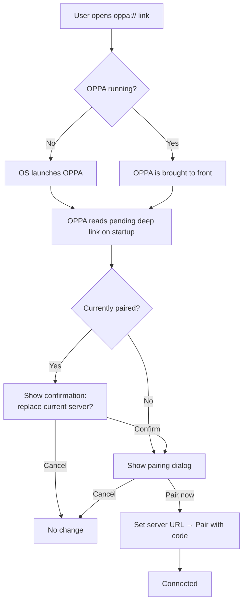

A server or dashboard can direct a user to pair OPPA by opening a
custom URL. The link carries the server address and a one-time pairing
code; OPPA decodes them and presents a confirmation dialog before
making any changes.

## URL format

```
oppa://pair?server=<base64url-server-url>&key=<pairing-code>
```

| Parameter | Description |
|-----------|-------------|
| `server`  | The OpenPrinter server base URL, encoded as Base64URL (no padding) |
| `key`     | The one-time pairing code created by the server administrator |

### Encoding the server URL

The `server` parameter is the base URL Base64URL-encoded without
padding characters (`=`). For example:

```
https://print.example.com/
→ aHR0cHM6Ly9wcmludC5leGFtcGxlLmNvbS8
```

A complete link for that server with pairing code `ABCD-EFGH`:

```
oppa://pair?server=aHR0cHM6Ly9wcmludC5leGFtcGxlLmNvbS8&key=ABCD-EFGH
```

## Generating a link

### Node.js / TypeScript

```ts
function oppaPairLink(serverUrl: string, pairingCode: string): string {
  const encoded = Buffer.from(serverUrl).toString('base64url');
  return `oppa://pair?server=${encoded}&key=${pairingCode}`;
}

// Example
const link = oppaPairLink('https://print.example.com/', 'ABCD-EFGH');
// → oppa://pair?server=aHR0cHM6Ly9wcmludC5leGFtcGxlLmNvbS8&key=ABCD-EFGH
```

### Python

```python
import base64

def oppa_pair_link(server_url: str, pairing_code: str) -> str:
    encoded = base64.urlsafe_b64encode(server_url.encode()).rstrip(b'=').decode()
    return f"oppa://pair?server={encoded}&key={pairing_code}"
```

### Browser (Web Crypto / btoa)

```js
function oppaPairLink(serverUrl, pairingCode) {
  const encoded = btoa(serverUrl)
    .replace(/\+/g, '-')
    .replace(/\//g, '_')
    .replace(/=+$/, '');
  return `oppa://pair?server=${encoded}&key=${pairingCode}`;
}
```

## What happens when the link is opened



### Unpaired state

When OPPA has no active server, the dialog appears immediately and
the user can review the server URL, set their agent name, and pair.

### Already-paired state

When OPPA is already connected to a server, the dialog includes a
warning that confirming will disconnect and require re-pairing. The
current server is forgotten only after the user explicitly confirms.

## Agent name

The dialog always asks the user to confirm or edit their agent name
before pairing. The link carries no agent name: this identity is
personal to the computer and cannot be set remotely.

## Using links in practice

**QR code at an install station** — Generate a QR from the link and
display it alongside the OPPA download page. After installation the
user scans the code and OPPA opens ready to pair.

**Server dashboard** — Display a "Pair OPPA" button that opens the
link with a freshly issued pairing code. The code expires on the
server's normal schedule (typically five minutes); the link becomes
invalid after expiry or after a successful pair.

**Email or setup guide** — Embed the link as an anchor with text such
as "Open in OPPA". Operating systems route `oppa://` links to the
installed app.

## Security notes

- The link contains a **one-time code**. Once used, the server
  invalidates it. A second open of the same link will fail at the
  pairing step.
- The link carries the server **URL**, not credentials. The user
  always reviews and confirms before any key is generated or
  transmitted.
- OPPA requires explicit user confirmation before replacing an
  existing paired server, preventing a malicious link from silently
  overriding an active configuration.
- Treat generated links with the same care as the pairing code itself:
  they should be short-lived and delivered over a trusted channel.
